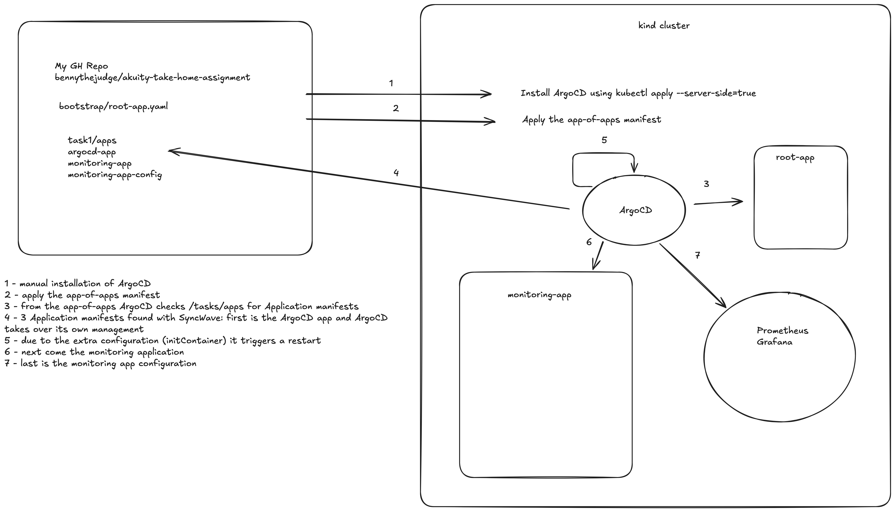
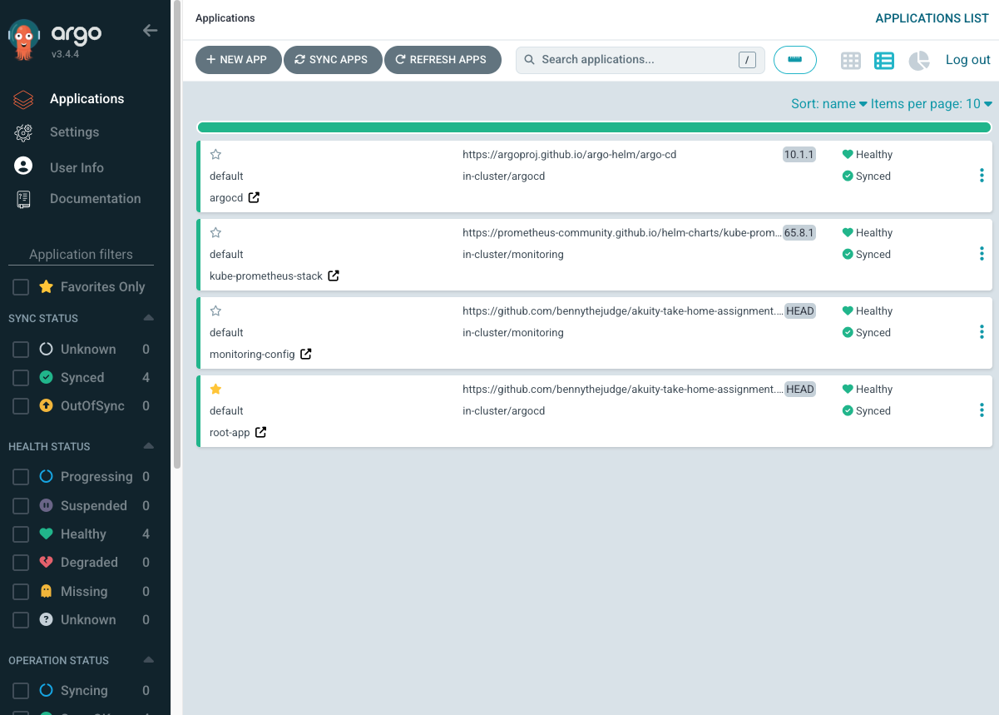
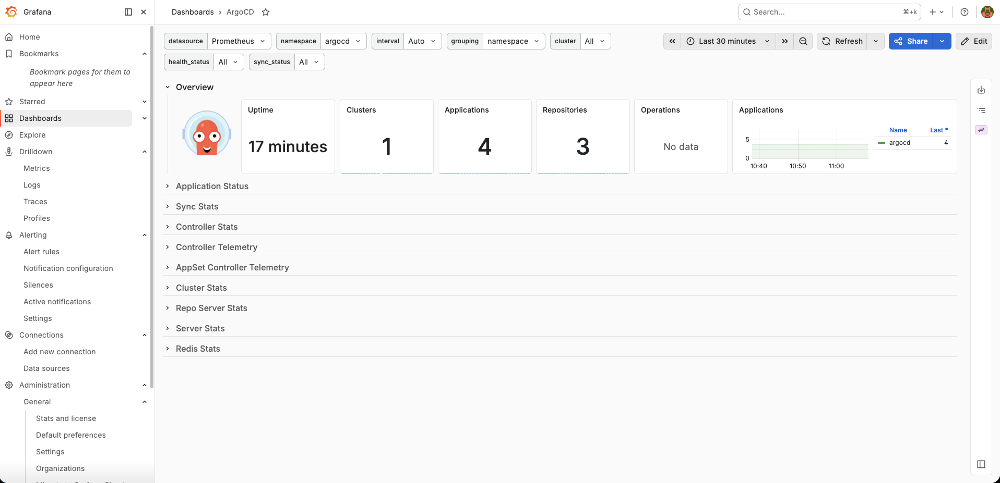
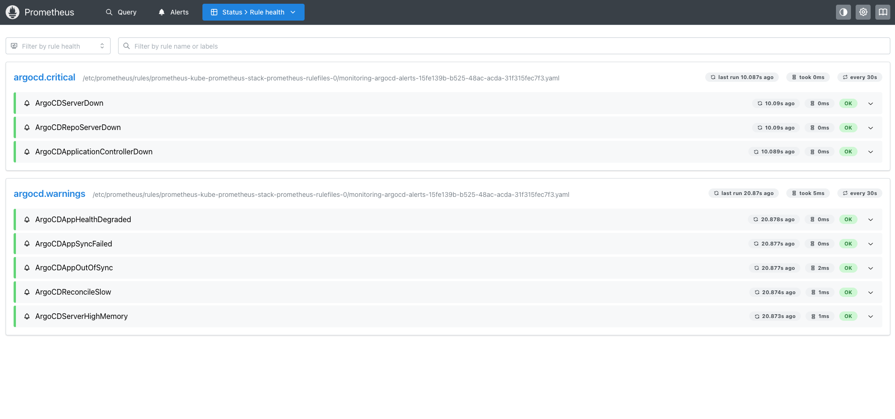
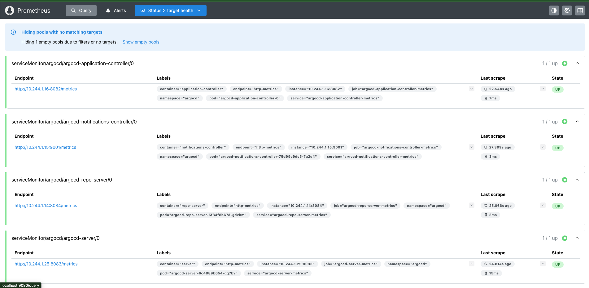
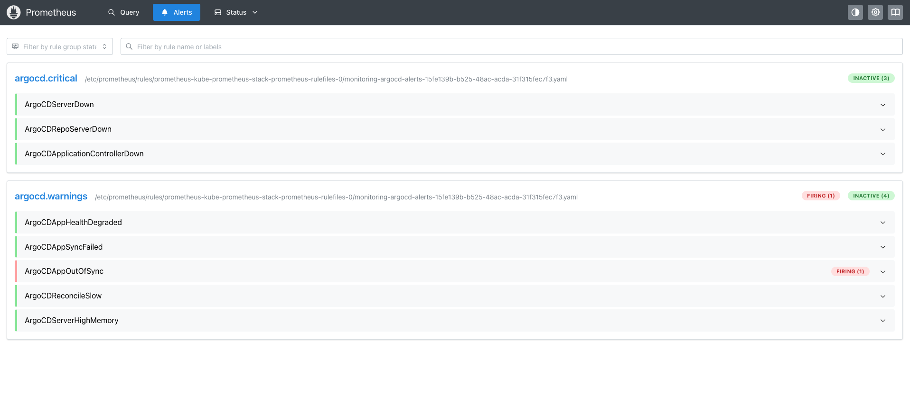
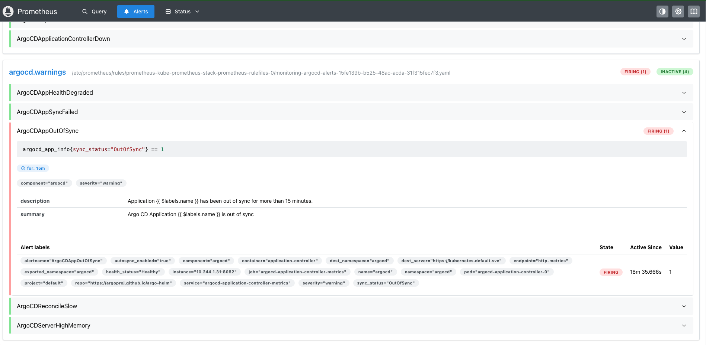

# Verification and testing

## Architecture Designs



High-level architecture sketch for the task 1 GitOps setup.

## Verify Helm Version Replacement

```bash
task check-helm-version-inside-repo-server
task: [check-helm-version-inside-repo-server] echo "Checking Helm version inside Argo CD repo-server"
Checking Helm version inside Argo CD repo-server
task: [check-helm-version-inside-repo-server] kubectl exec -n argocd deploy/argocd-repo-server -c repo-server -- helm version --short
v3.7.2+g663a896
```

## Verify Prometheus is Monitoring Argo CD

### Check `ServiceMonitors` are created

```bash
k get servicemonitor -n argocd
NAME                              AGE
argocd-application-controller     65m
argocd-notifications-controller   65m
argocd-redis                      65m
argocd-repo-server                65m
argocd-server                     65m
```

Expected:

- argocd-server-metrics
- argocd-repo-server-metrics
- argocd-application-controller-metrics
- argocd-redis

### Check Prometheus targets

- Open Prometheus UI (see [README.md](../README.md))
- Navigate to Status → Targets
- Look for Argo CD targets (should be UP)

### Check Prometheus rules

```bash
k get prometheusrules -n monitoring
NAME                                                              AGE
argocd-alerts                                                     67m
kube-prometheus-stack-k8s.rules.container-cpu-usage-seconds-tot   67m
kube-prometheus-stack-k8s.rules.container-memory-cache            67m
kube-prometheus-stack-k8s.rules.container-memory-rss              67m
kube-prometheus-stack-k8s.rules.container-memory-swap             67m
kube-prometheus-stack-k8s.rules.container-memory-working-set-by   67m
kube-prometheus-stack-k8s.rules.container-resource                67m
kube-prometheus-stack-k8s.rules.pod-owner                         67m
kube-prometheus-stack-kube-apiserver-burnrate.rules               67m
kube-prometheus-stack-kube-apiserver-histogram.rules              67m
kube-prometheus-stack-kube-scheduler.rules                        67m
kube-prometheus-stack-kubernetes-system-controller-manager        67m
kube-prometheus-stack-kubernetes-system-scheduler                 67m
kube-prometheus-stack-prometheus                                  67m
kube-prometheus-stack-prometheus-operator                         67m
```

### View Argo CD dashboard in Grafana

- Open Grafana UI (see [README.md](../README.md))
- Navigate to Dashboards
- Look for "ArgoCD" dashboard

## Screenshots

Screenshots captured for task 1.

### Argo CD UI



The Argo CD UI after the application setup is applied.

### Grafana



### Prometheus

#### Rules



#### Targets



#### Alerts



#### Alert firing


